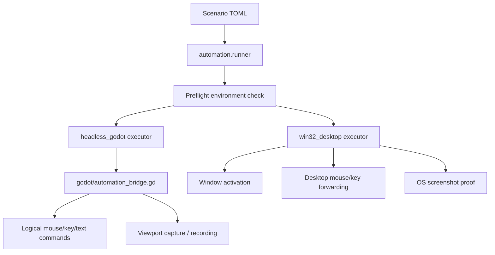

# Automation Stack

## Policy

- `computer_use` is not the primary Godot QA path.
- `headless_godot` is the preferred deterministic path.
- `win32_desktop` is the desktop proof fallback.
- The desktop runner must fail early if dependencies are missing instead of
  pretending the scenario was executed.
