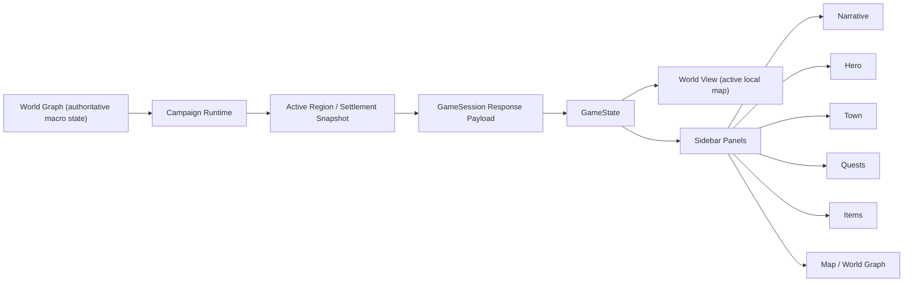

# Runtime Authority

This diagram defines the current authoritative runtime split for Ember RPG.

## Authority Rules

- `WorldBlueprint` and the world graph remain the macro authority.
- Only one local region/settlement is hydrated in detail at a time.
- `SimulationSnapshot.region_states` is the canonical runtime store for:
  - region economy
  - alerts and pressure
  - travel reachability
  - active local runtime enrichments
- `GameState` is the canonical runtime/save-load projection assembled by the
  campaign runtime from typed kernel state. It is not a second independent
  simulation authority, but it is the primary persistence and client handoff
  root for campaign-local play state.
- Campaign save/session serialization now persists canonical kernel roots
  (`kernel_world_state`, `kernel_game_state`) at the session-state top level as
  well as inside `campaign_v2`, and strict load validates those roots before
  hydrating the runtime.
- Campaign payloads should now expose both:
  - typed kernel slices (`world_state`, `actors`, `jobs`, `systems`, ...)
  - a `game_state` root container for save/load round-trip and local runtime continuity
- Sidebar panels must expose distinct layers instead of hiding state inside a
  `TabContainer` tab strip the player has to discover.

## Active Problems This Sprint Fixes

- Character creation state still influences campaign setup through a constrained
  deterministic profile rather than a deeper authored background graph
- Some API/session surfaces still carry legacy compatibility shims, but campaign
  save/load now fails fast on invalid kernel roots instead of rebuilding from
  those shims silently
