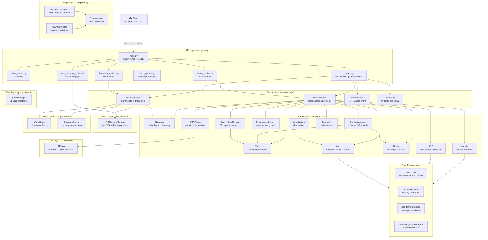

# 🔥 Ember RPG — AI-Driven Fantasy RPG Backend

> *"Natural language in, narrative out."*

Ember RPG is a **Python/FastAPI backend** for an AI-driven tabletop-style RPG. Players describe their actions in plain English; the AI Dungeon Master (DM) narrates the world, drives combat, manages quests, and keeps the story alive — all via a clean REST API.

---

## Table of Contents

1. [Features](#features)
2. [Architecture](#architecture)
3. [Quick Start](#quick-start)
4. [API Reference](#api-reference)
5. [Game Systems](#game-systems)
6. [Data Files](#data-files)
7. [Testing](#testing)
8. [Project Structure](#project-structure)
9. [Roadmap](#roadmap)

---

## Features

- 🤖 **AI Dungeon Master** — OpenAI-powered narrative generation
- ⚔️ **Full Combat Engine** — turn-based combat with initiative, AP, status effects
- 🧙 **Magic System** — 50+ spells across 8 schools with mana cost, range, effects
- 🗺️ **Procedural Maps** — dungeon & town tile generation with rooms, corridors, NPCs
- 👥 **NPC Agent System** — personality-driven NPCs with dialogue templates
- 📜 **Campaign Generator** — quest structures, objectives, locations
- 📈 **Progression System** — leveling, stat growth, ability unlocks
- 🌐 **REST API** — stateless HTTP, session-based, easy Godot/Unity/web integration

---

## Architecture

### Mermaid Flow Diagram



### ASCII Quick Reference

```
┌─────────────────────────────────────────────────────────┐
│                     CLIENT LAYER                        │
│        Godot 4 Client / Web Frontend / CLI              │
└────────────────────────┬────────────────────────────────┘
                         │ HTTP REST (JSON)
┌────────────────────────▼────────────────────────────────┐
│                API LAYER  (engine/api/)                 │
│  routes.py · shop_routes · save_routes · scene_routes  │
│           inventory_routes · npc_memory_routes          │
│                                                         │
│  ┌──────────────┐  ┌──────────────┐  ┌──────────────┐  │
│  │  GameEngine  │  │  GameSession │  │ActionParser  │  │
│  │  (orchestr.) │  │  (state)     │  │(NL → intent) │  │
│  └──────┬───────┘  └──────┬───────┘  └──────────────┘  │
└─────────┼─────────────────┼──────────────────────────── ┘
          │                 │
┌─────────▼─────────────────▼─────────────────────────── ┐
│                CORE MODELS  (engine/core/)              │
│  Character · Combat · Spell · Effect · Item · Rules    │
│  Progression · DMAIAgent · Loot · Monster · EnemyAI   │
└─────────┬───────────────────────────────────┬──────────┘
          │                                   │
┌─────────▼──────┐    ┌──────────┐   ┌────────▼───────┐
│  MAP MODULE    │    │  WORLD   │   │   NPC MODULE   │
│  DungeonGen    │    │WorldState│   │ NPCMemoryMgr   │
│  TownGen       │    │Cascade   │   │ NPC templates  │
└────────────────┘    └──────────┘   └────────────────┘
          │
┌─────────▼──────────────────────────────────────────────┐
│                    DATA LAYER                          │
│  items.json · monsters.json · npc_templates.json       │
│  campaign_templates.json · saves/*.json                │
└────────────────────────────────────────────────────────┘
                         │
┌────────────────────────▼────────────────────────────── ┐
│                   LLM LAYER                            │
│         LLMRouter → OpenAI / Copilot / fallback        │
└────────────────────────────────────────────────────────┘
```

### Key Design Decisions

| Decision | Rationale |
|---|---|
| FastAPI over Flask | Async-ready, auto-docs (Swagger), Pydantic validation |
| In-memory sessions | Simple MVP; Redis planned for production |
| JSON data files | Human-editable game content; no DB migration headaches |
| OpenAI for narrative | Best quality; swappable via DMAIAgent interface |
| Stateless HTTP | Easy scaling; Godot client reconnects cleanly |

---

## Quick Start

### Prerequisites

- Python 3.11+
- OpenAI API key (for DM narrative generation)

### Installation

```bash
# Clone the repo
git clone https://github.com/msbel5/ember-rpg.git
cd ember-rpg

# Create virtual environment
python3 -m venv venv
source venv/bin/activate  # Windows: venv\Scripts\activate

# Install dependencies
pip install -e .
# or: pip install -r requirements.txt
```

### Environment

```bash
# Required
export OPENAI_API_KEY=sk-...

# Optional
export EMBER_HOST=0.0.0.0
export EMBER_PORT=8000
export EMBER_LOG_LEVEL=info
```

### Run

```bash
uvicorn main:app --reload --host 0.0.0.0 --port 8000
```

Visit **http://localhost:8000/docs** for the interactive Swagger UI.

---

## API Reference

Base URL: `http://localhost:8000/game`

### `POST /session/new` — Create Session

Start a new game session for a player.

**Request**
```json
{
  "player_name": "Arion",
  "player_class": "mage",
  "location": "The Ashwood Dungeon"
}
```

**Response**
```json
{
  "session_id": "abc123",
  "narrative": "You step into the cold darkness of the Ashwood Dungeon...",
  "player": {
    "name": "Arion",
    "class": "mage",
    "level": 1,
    "hp": 20,
    "max_hp": 20,
    "mana": 30,
    "max_mana": 30
  },
  "scene": "exploration",
  "location": "The Ashwood Dungeon"
}
```

**Player classes:** `warrior`, `mage`, `rogue`, `cleric`, `ranger`

---

### `POST /session/{session_id}/action` — Take Action

Send a natural-language player action.

**Request**
```json
{
  "input": "I cast Fireball at the group of goblins!"
}
```

**Response**
```json
{
  "narrative": "With a thunderous BOOM, a sphere of roiling fire erupts among the goblins...",
  "scene": "combat",
  "player": { "hp": 18, "mana": 24, ... },
  "combat": {
    "round": 2,
    "active": "Goblin Shaman",
    "ended": false,
    "combatants": [
      { "name": "Arion", "hp": 18, "max_hp": 20, "ap": 2, "dead": false },
      { "name": "Goblin", "hp": 0, "max_hp": 8, "ap": 0, "dead": true }
    ]
  },
  "state_changes": { "xp_gained": 50 },
  "level_up": null
}
```

**Example actions:**
- `"I attack the orc with my sword"`
- `"I cast Heal on myself"`
- `"I search the room for traps"`
- `"I talk to the innkeeper about rumors"`
- `"I run away!"`

---

### `GET /session/{session_id}` — Get Session State

**Response**
```json
{
  "session_id": "abc123",
  "scene": "exploration",
  "location": "The Ashwood Dungeon",
  "player": { ... },
  "in_combat": false,
  "turn": 14
}
```

---

### `GET /session/{session_id}/map` — Get Map

Procedurally generated tile map for the current location.

**Query params:** `?seed=42` (optional, for deterministic generation)

**Response**
```json
{
  "session_id": "abc123",
  "location": "The Ashwood Dungeon",
  "map": {
    "width": 40,
    "height": 40,
    "tiles": [[0, 0, 1, ...], ...],
    "rooms": [
      { "x": 5, "y": 5, "width": 8, "height": 6 }
    ],
    "metadata": { "type": "dungeon", "seed": 42 }
  }
}
```

**Tile types:** `0` = wall, `1` = floor, `2` = door, `3` = water, `4` = stairs

---

### `DELETE /session/{session_id}` — End Session

```json
{ "message": "Session ended." }
```

---

### Error Responses

| Code | Meaning |
|---|---|
| `404` | Session not found |
| `422` | Validation error (bad request body) |
| `403` | Forbidden action |
| `500` | Internal server error |

---

## Game Systems

### Combat

Turn-based with initiative order. Each combatant has **AP (Action Points)** per round.

- Actions: `attack`, `cast`, `defend`, `flee`, `use item`
- Status effects: `stunned`, `poisoned`, `burning`, `hasted`, `slowed`, `held`
- Combat ends when all enemies are dead, or player flees successfully

### Magic

Spells consume **mana**. Mana regenerates between fights.

- 8 schools: `evocation`, `abjuration`, `necromancy`, `transmutation`, `illusion`, `conjuration`, `divination`, `enchantment`
- 5 spell levels (1–5)
- Targeting: `single`, `area`, `self`, `ally`, `cone`

### Character Classes

| Class | HP | Mana | Primary Stat | Playstyle |
|---|---|---|---|---|
| Warrior | High | None | Strength | Melee combat, tanking |
| Mage | Low | High | Intelligence | Ranged spells, burst damage |
| Rogue | Medium | Low | Dexterity | Stealth, critical hits |
| Cleric | Medium | Medium | Wisdom | Healing, buffs, undead control |
| Ranger | Medium | Low | Dexterity | Ranged attacks, traps |

### Progression

- XP gained from combat, quests, exploration
- Level up increases HP, mana, stats, unlocks abilities
- Max level: 20

---

## Data Files

### `data/spells.json`

Spell database. Schema:

```json
{
  "spells": [
    {
      "name": "Fireball",
      "cost": 5,
      "range": 150,
      "target_type": "area",
      "school": "evocation",
      "level": 3,
      "description": "A bright streak of flame explodes in a 20-foot radius.",
      "effects": [
        {
          "type": "damage",
          "amount": "8d6",
          "damage_type": "fire",
          "save": "dexterity",
          "save_dc": 14
        }
      ]
    }
  ]
}
```

**Effect types:** `damage`, `heal`, `status`, `buff`, `summon`, `utility`

---

## Testing

### Coverage

Current API layer coverage: **93%** (engine/api + main.py)

| Module | Coverage |
|---|---|
| `engine/api/__init__.py` | 100% |
| `engine/api/action_parser.py` | 90% |
| `engine/api/game_engine.py` | 91% |
| `engine/api/game_session.py` | 100% |
| `engine/api/inventory_routes.py` | 97% |
| `engine/api/models.py` | 100% |
| `engine/api/npc_memory_routes.py` | 100% |
| `engine/api/routes.py` | 88% |
| `engine/api/save_routes.py` | 100% |
| `engine/api/scene_routes.py` | 89% |
| `engine/api/shop_routes.py` | 98% |
| `main.py` | 91% |

```bash
# Run coverage-targeted test suite (fast, no LLM)
pytest tests/test_coverage_boost.py tests/test_shop.py tests/test_npc_memory_routes.py \
    --cov=engine/api --cov=main --cov-report=term-missing

# Run all tests
cd frp-backend
pytest tests/ -v

# E2E test suite only (curl simulation)
pytest tests/test_e2e_curl_simulation.py -v

# With API-layer coverage report
pytest tests/test_e2e_curl_simulation.py tests/test_api.py tests/test_integration.py \
    tests/test_action_parser.py tests/test_game_engine.py tests/test_routes.py \
    --cov=engine/api --cov=main --cov-report=term-missing

# Run specific test file
pytest tests/test_spell.py -v
```

### Coverage Report (API Layer)

Last run: **257 tests, 83% API coverage**

| Module | Stmts | Cover |
|---|---|---|
| `engine/api/action_parser.py` | 76 | **100%** |
| `engine/api/game_session.py` | 34 | **100%** |
| `engine/api/models.py` | 39 | **100%** |
| `engine/api/game_engine.py` | 165 | **99%** |
| `engine/api/routes.py` | 60 | 90% |
| `engine/api/save_routes.py` | 63 | 90% |
| `main.py` | 20 | 90% |
| `engine/api/scene_routes.py` | 32 | 72% |
| `engine/api/npc_memory_routes.py` | 26 | 46% |
| `engine/api/shop_routes.py` | 114 | 37% |

> **Target:** 90%+ across `engine/api/` core modules (action_parser, game_engine, game_session, models, routes).

### Test Files

| File | What It Covers |
|---|---|
| `test_e2e_curl_simulation.py` | **E2E:** Full HTTP lifecycle, curl simulation (70 tests) |
| `test_integration.py` | Full scenario flows: combat, save/load, NPC, map, concurrency |
| `test_api.py` | ActionParser, GameEngine, GameSession, HTTP routes |
| `test_action_parser.py` | All intents (EN + TR), target extraction |
| `test_game_engine.py` | Session creation, action processing, LLM mock |
| `test_routes.py` | FastAPI route handlers |
| `test_character.py` | Character creation, stats, class bonuses |
| `test_combat.py` | Combat rounds, initiative, AP |
| `test_spell.py` | Spell loading, casting, mana cost |
| `test_item.py` | Item use, equipment, inventory |
| `test_effect.py` | Status effects, duration, stacking |
| `test_progression.py` | Leveling, XP, ability unlocks |
| `test_dm_agent.py` | Narrative generation, event types |
| `test_map.py` | Dungeon/town generation |
| `test_npc.py` | NPC personalities, dialogue |
| `test_campaign.py` | Campaign structure, quests |

---

## Project Structure

```
frp-backend/
├── main.py                  # FastAPI app entry point
├── requirements.txt
├── pyproject.toml
├── data/
│   ├── spells.json          # Spell database (50+ spells)
│   └── items.json           # Item database (planned)
├── engine/
│   ├── api/
│   │   ├── routes.py        # FastAPI route handlers
│   │   ├── models.py        # Pydantic request/response models
│   │   ├── game_engine.py   # Session orchestration
│   │   ├── game_session.py  # Session state
│   │   └── action_parser.py # NL → game intent parser
│   ├── core/
│   │   ├── character.py     # Character stats, inventory
│   │   ├── combat.py        # Combat engine
│   │   ├── spell.py         # Spell loading, casting
│   │   ├── item.py          # Item system
│   │   ├── effect.py        # Status effects
│   │   ├── progression.py   # Leveling system
│   │   ├── dm_agent.py      # AI DM narrative agent
│   │   └── rules.py         # Game rules, constants
│   ├── map/
│   │   ├── dungeon.py       # Procedural dungeon generator
│   │   └── town.py          # Procedural town generator
│   ├── npc/                 # NPC agent system
│   └── campaign/            # Campaign generator
└── tests/
    ├── test_spell.py
    ├── test_combat.py
    └── ...                  # 12 test files, 98%+ coverage
```

---

## Roadmap

### In Progress
- [ ] Item database (50+ weapons, armor, potions)
- [ ] Monster bestiary (30+ monsters with loot tables)
- [ ] Save/load system
- [ ] Edge case hardening → 99%+ test coverage

### Planned
- [ ] WebSocket support (real-time combat events)
- [ ] Godot 4 client (see `PRD_godot_client.md`)
- [ ] Campaign templates (tutorial, main quest, side quests)
- [ ] NPC dialogue templates (20+ personalities)

### Future
- [ ] Multiplayer / local co-op
- [ ] Steam / Web deployment
- [ ] Modding API

---

## License

MIT — see LICENSE file.

---

*Ember RPG is part of the Blue Bird project. Built with ❤️ and 🔥.*
